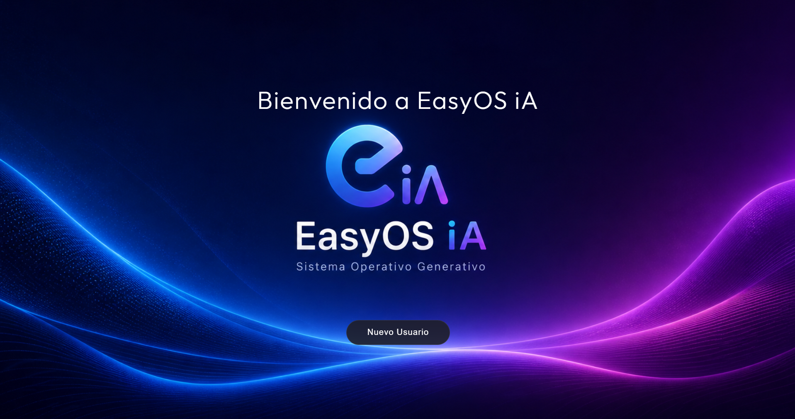
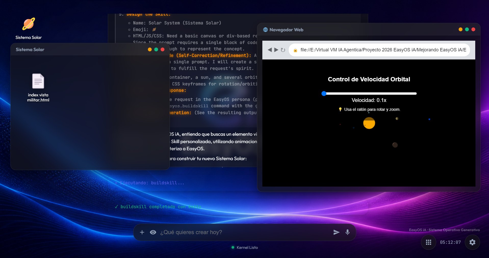

# ✨ EasyOS iA — El Sistema Operativo Generativo 🇪🇸

[](https://www.electronjs.org/)
[](https://developer.mozilla.org/es/docs/Web/JavaScript)
[](https://github.com/topics/generative-ai)
[](https://github.com/Isabel-EasyIA/EasyOS-iA---Sistema-Operativo-Generativo)
[](#)

**EasyOS iA** representa un cambio de paradigma en la computación personal: una **arquitectura de computación soberana** donde la interfaz no está predefinida, sino que **emerge y evoluciona** orgánicamente mediante inteligencia artificial generativa. 

Constituye un ecosistema **Zero-Baseline** de vanguardia, diseñado para autoconstruir su propia lógica, herramientas y entorno visual en tiempo real, garantizando la persistencia física de los datos y una autonomía operativa absoluta.

“El software no existe, se genera cuando el usuario lo necesita..., solo pídalo al Modelo iA, y le creara una aplicación hecha a su medida.”

> [!IMPORTANT]
> **Technical Demo:** Esta implementación es una demostración técnica avanzada para validar el concepto de sistemas operativos generativos y computación dirigida por IA.

---

## 🚀 La Filosofía "Zero-Baseline"

A diferencia de los sistemas operativos tradicionales que vienen con gigabytes de software preinstalado, EasyOS iA comienza como un lienzo en blanco (un kernel y una API de primitivas). 

1.  **Soberanía de Datos:** Cada aplicación, ventana, icono o configuración generada por la IA se traduce en **archivos físicos reales** en el disco duro. Nada es volátil; si la IA crea una herramienta para ti, esa herramienta te pertenece y reside en tu sistema.
2.  **IA como Arquitecto Maestro:** El modelo de lenguaje tiene "manos" en el sistema host. A través de una API de primitivas nativas, puede leer, escribir, ejecutar comandos y orquestar el entorno sin las restricciones de un navegador convencional.
3.  **Independencia de la Interfaz:** La UI es fluida. La IA puede decidir crear un botón, un gráfico complejo o una terminal completa según la necesidad del momento.

---

## 🛠️ Stack Tecnológico Premium

El sistema está diseñado para ofrecer una experiencia visual de alto nivel (UX Premium) combinada con la potencia del acceso a bajo nivel:

-   **Motor Visual:** HTML5, CSS3 con efectos de **Glassmorphism** y animaciones dinámicas de fondo (blobs).
-   **Runtime Nativo:** Ejecutado sobre **Electron (Node.js)**, lo que permite romper el sandbox del navegador para acceder al sistema de archivos, ejecutar procesos hijos (Python, Node, C++, etc.) y navegar sin problemas de CORS.
-   **Cerebro (IA):** Compatible con cualquier modelo que soporte el protocolo OpenAI API (Llama 3, GPT-4, modelos locales vía Ollama o vLLM).
-   **Sintaxis de Comandos Simplificada:** Utiliza un formato natural y legible `easyos.comando{[p1], [p2], ...}` que permite a la IA invocar acciones del sistema de forma fluida y multitarea, sin necesidad de estructuras JSON rígidas.

---

## 📂 Estructura del Ecosistema

El proyecto se organiza para garantizar que el núcleo sea inmutable mientras que el espacio del usuario sea infinitamente expandible:

```text
EasyOS iA/
├── assets/                       ← Recursos estáticos (wallpapers, sonidos)
├── extensions/                   ← Skills Maestras (Oficiales: EasyOS_*)
│   ├── EasyOS_Editor.js          ← Editor profesional con terminal integrada
│   ├── EasyOS_Terminal.js        ← Consola de comandos nativa
│   └── EasyOS_WebBrowser.js      ← Navegador con acceso a archivos locales
├── Imagenes/                     ← Galería de capturas y media del proyecto
├── js/
│   ├── api.js                    ← El "Contrato": Primitivas del sistema (SystemAPI)
│   ├── ai.js                     ← Conector de inteligencia y gestión de prompts
│   ├── kernel.js                 ← Orquestador, Sandbox DSL y gestión de ventanas
│   └── chat.js                   ← Motor de la interfaz de comunicación
├── EasyOS iA/ (Root de Datos)
│   └── users/
│       └── <usuario>/            ← Perfil independiente y persistente
│           ├── documents/        ← Archivos reales creados por el usuario/IA
│           ├── extensions/       ← Skills instaladas/generadas para este usuario
│           └── config/           ← Estado del escritorio, historial de chat y JSONs
└── main.js                       ← Punto de entrada de Electron
```

---

## 👥 Sistema de Usuarios y Persistencia Total

EasyOS iA es un sistema multiusuario por diseño físico:

-   **Aislamiento de Perfiles:** Cada usuario tiene su propia jerarquía de carpetas. Los documentos de un usuario no son visibles para otro.
-   **Sincronización de Herramientas:** Al iniciar sesión, el sistema sincroniza automáticamente las **Extensions Oficiales** desde la carpeta maestra, asegurando que todos los usuarios tengan las versiones más estables y seguras de las herramientas críticas.
-   **Desktop State:** El archivo `desktop_state.json` recuerda exactamente dónde dejaste cada ventana e icono, permitiendo retomar la sesión tal como estaba.
-   **Historial de Chat Segmentado:** Las conversaciones con la IA se guardan por sesiones, permitiendo tener múltiples hilos de trabajo independientes.

---

## ⚡ API de Primitivas (Sintaxis AI)

La IA interactúa con el mundo físico mediante comandos simplificados que el Kernel interpreta en tiempo real. Estos comandos pueden incluirse directamente en la respuesta de la IA:

| Comando AI | Acción | Descripción Técnica |
| :--- | :--- | :--- |
| `easyos.savefile{[emoji], [name], [content]}` | **Guardar Archivo** | Crea o sobreescribe un archivo físico en el disco del usuario. |
| `easyos.createfolder{[emoji], [name]}` | **Crear Carpeta** | Crea directorios reales en el filesystem para organizar datos. |
| `easyos.runcommand{[comando]}` | **Ejecutar Proceso** | Ejecuta comandos de sistema (npm, python, git) de forma nativa. |
| `easyos.buildskill{[name], [emoji], [html]}` | **Construir Skill** | Genera y guarda una nueva aplicación persistente (.js). |
| `easyos.removeitem{[ruta]}` | **Eliminar Item** | Borra archivos o carpetas del sistema físico. |
| `easyos.easyos_webbrowser{[url], [titulo]}` | **Navegador** | Abre el explorador web en una URL específica. |
| `easyos.easyos_editor{[ruta]}` | **Editor Pro** | Abre el editor oficial con acceso al archivo indicado. |
| `easyos.easyos_terminal{[ruta], [cmd]}` | **Terminal Pro** | Abre la consola nativa en una ruta y ejecuta un comando. |
| `easyos.editskill{[name]}` | **Editar Skill** | Abre el código fuente de una aplicación para modificarla. |

---

## 📦 Herramientas Oficiales (Extensions)

El sistema incluye un conjunto de "Skills Maestras" que sirven como base para la productividad:

### 📝 EasyOS_Editor
Un editor de código profesional integrado que permite:
- Navegar por el árbol de archivos real del usuario.
- Editar múltiples archivos con resaltado básico.
- **Terminal Integrada:** Ejecutar el código (Node.js, Python) directamente desde el editor y ver la salida en una consola inferior.

### 💻 EasyOS_Terminal
Una consola de comandos que actúa como puente directo con el sistema operativo anfitrión, permitiendo la instalación de dependencias y la gestión de proyectos mediante comandos reales.

### 🌐 EasyOS_WebBrowser
Un navegador interno optimizado para visualizar tanto URLs externas como archivos HTML locales generados por la propia IA, sin las restricciones de seguridad típicas del navegador (CORS).

---

## 🔒 Seguridad y Robustez

A pesar de su apertura, EasyOS iA implementa capas de protección críticas:
-   **Protección del Núcleo:** Los métodos definidos en `SystemAPI.coreMethods` son inmutables. Ninguna skill o código generado puede sobrescribir las funciones vitales del sistema.
-   **Validación de Rutas:** Todas las operaciones de archivos están ancladas al directorio del usuario, evitando que la IA o el código generado puedan acceder a archivos sensibles del sistema operativo anfitrión.
-   **Iterative Command Parser:** El kernel utiliza un motor de análisis iterativo que protege la integridad de los datos, permitiendo la transferencia de código complejo (HTML/CSS/JS) sin errores de sintaxis.

---

## 🖥️ Interfaz y Experiencia de Usuario (UX)

-   **Visuales Premium:** Uso de desenfoques Gaussianos, sombras dinámicas y colores vibrantes sobre fondos oscuros.
-   **Detección de Emojis:** El sistema analiza los nombres de archivos; si detecta un emoji al inicio (ej: `🚀_Proyecto`), lo utiliza automáticamente como icono visual en el escritorio.
-   **Pensamiento Transparente:** Cuando la IA está razonando, sus pensamientos se muestran en bloques colapsables (`<thought>`), permitiendo al usuario entender el proceso creativo detrás de cada acción.

---

## 🚀 Instalación y Ejecución

Para poner en marcha tu propio EasyOS iA:

1.  **Clonar el repositorio:**
    ```bash
    git clone https://github.com/Isabel-EasyIA/EasyOS-iA---Sistema-Operativo-Generativo.git
    cd EasyOS-iA
    ```

2.  **Instalar dependencias:**
    ```bash
    npm install
    ```

3.  **Iniciar el sistema:**
    ```bash
    npm start
    ```

---

## 🔮 Hoja de Ruta (Roadmap)

- [ ] Soporte para Drag & Drop de archivos desde el SO host.
- [ ] Integración de modelos multimodales (Visión para analizar capturas de pantalla).
- [ ] Marketplace de Skills generadas por la comunidad.
- [ ] Sistema de virtualización de red para pruebas de pentesting controladas.

---

## 📄 Licencia

Este proyecto está bajo la licencia **ISC**. Siéntete libre de explorar, modificar y construir tu propio futuro generativo.

---



*Desarrollado con **Antigravity de Google AI** ❤️ y sus Modelos LLMs Gratuitos.*

---
